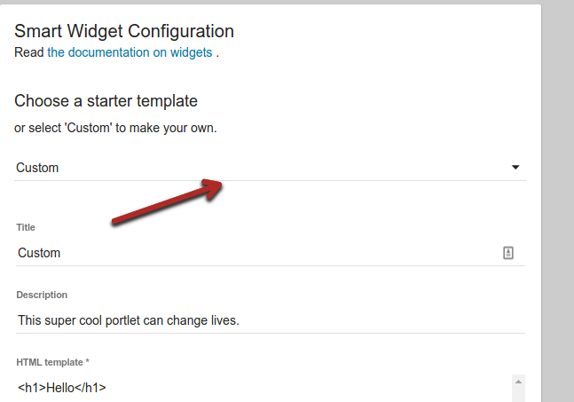

The
[Widget Documentation](http://uw-madison-doit.github.io/uw-frame/widgets.html)
has more information about configuration options and more technical details.

In the starter template, select `List of Links` from the drop down.



A title and description have already been provided.


Widget configuration - Notice that sample text has already been provided:
```json
{"launchText":"Launch the Full App","additionalText":"Additional Text","links":[{"title":"The Google","href":"http://www.google.com","icon":"fa-google","target":"_blank","rel":"noopener noreferrer"},{"title":"Bing","href":"http://www.bing.com","icon":"fa-bed","target":"_blank","rel":"noopener noreferrer"}]}
```

Let’s format that JSON so it’s easier to read
```json
{
  "launchText": "Launch the Full App",
  "additionalText": "Additional Text",
  "links": [
    {
      "title": "The Google",
      "href": "http://www.google.com",
      "icon": "fa-google",
      "target": "_blank",
      "rel": "noopener  noreferrer"
    },
    {
      "title": "Bing",
      "href": "http://www.bing.com",
      "icon": "fa-bed",
      "target": "_blank",
      "rel": "noopener noreferrer"
    }
  ]
}
```


Click the update button and notice that you have a fully functioning list of links widget already.

Let’s create our own list of links widget.  We’ll use Apereo projects in our example.

For Title, type in “Apereo Projects”.

Description, type “My very first list of links widget”

For the widget config, copy and paste this:

```json
{
  "launchText": "All Apereo Projects",
  "links": [
    {
      "title":"uPortal",
      "href":"https://www.apereo.org/projects/uportal",
      "icon":"fa-google",
      "target":"_blank",
      "rel":"noopener  noreferrer"
    }
  ]
}
```

Finally, type ‘<https://www.apereo.org/content/projects-communities>’ for Launch URL

Let’s break that widget configuration down into parts.
The first part is to notice that the launch text is configurable.  Try updating the launch text to “See all Apereo projects”
```
"launchText":"See all Apereo Projects",
```

Click update and see what happens.

Try adding more links.  If you need help, here’s some sample widget configuration you can copy and paste.

```json
{
  "launchText": "See All Apereo Projects",
  "links": [
    {
      "title": "uPortal",
      "href": "https://www.apereo.org/projects/uportal",
      "icon": "fa-key",
      "target": "_blank",
      "rel": "noopener  noreferrer"
    },
    {
      "title": "Sakai Project",
      "href": "https://www.apereo.org/projects/sakai-project",
      "icon": "fa-folder-open",
      "target": "_blank",
      "rel": "noopener  noreferrer"
    }
  ]
}
```


You can keep adding more links and see that the widget auto formats the correct spacing and layout.

Try three links

```json
{
  "launchText": "See All Apereo Projects",
  "links": [
    {
      "title": "uPortal",
      "href": "https://www.apereo.org/projects/uportal",
      "icon": "fa-key",
      "target": "_blank",
      "rel": "noopener  noreferrer"
    },
    {
      "title": "Sakai Project",
      "href": "https://www.apereo.org/projects/sakai-project",
      "icon": "fa-folder-open",
      "target": "_blank",
      "rel": "noopener  noreferrer"
    },
    {
      "title": "Student Success Plan",
      "href": "https://www.apereo.org/projects/student-success-plan",
      "icon": "fa-graduation-cap",
      "target": "_blank",
      "rel": "noopener  noreferrer"
    }
  ]
}
```

See what happens the more you add!
