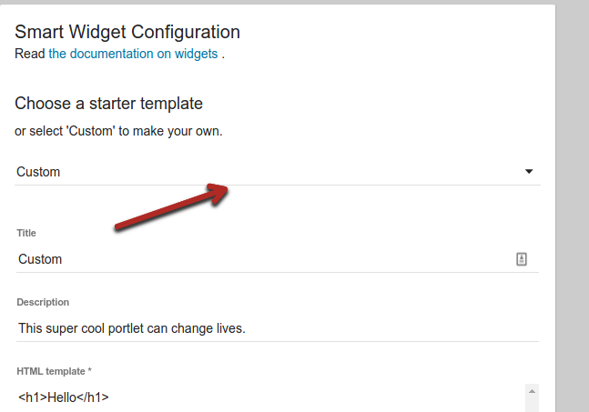

The
[Widget Documentation](http://uw-madison-doit.github.io/uw-frame/widgets.html)
has more information about configuration options and more technical details.

Choose `RSS widget` from the starter templates.



Give your RSS Widget the Title of
```
Apereo News
```

Give your RSS Widget a description of
```
The latest and greatest news from Apereo
```

You can leave the widget configuration as it is.

For the widget url use
```
https://api.rss2json.com/v1/api.json?rss_url=https%3A%2F%2Fwww.apereo.org%2Fnews%2Ffeed
```
This is JSONified rss feed of Apereo News.

Finally change the Launch URL to
```
https://www.apereo.org/news
```

Click update and see your new RSS Widget!
